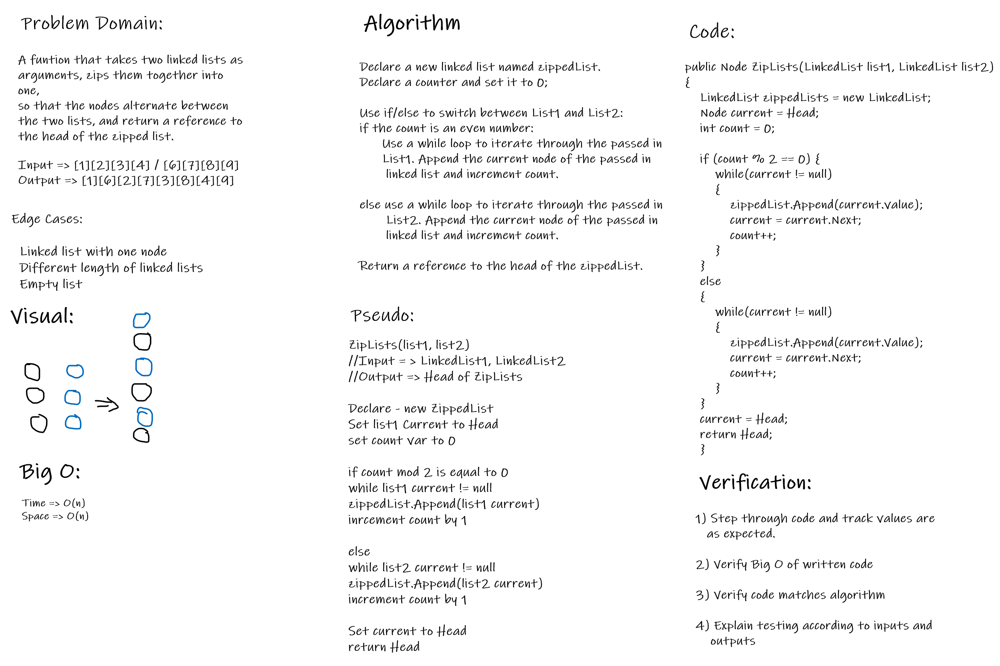

# Data Structure Implementation: Linked List : Zip Lists
---

## Linked List : Zip Lists

*Author: Na'ama Bar-Ilan

---

## Description

A C# implementation of a `Singly Linked List`. Singly Linked Lists contain individual nodes that have a reference to the `Next` node in the list as well as a `Value`. The methods of this `Linked List` are `Insert`, `Includes`, `ToString`, `Append`, `FindKthFromEnd`, and `ZipLists`.

---

## Methods

| Method | Summary | Big O Time | Big O Space | Example | 
| :----------- | :----------- | :-------------: | :-------------: | :----------- |
| ZipLists | Takes two linked lists as arguments, zips them together into one, so that the nodes alternate between the two lists, and returns a reference to the head of the zipped list | O(n) | O(n) | myList.ZipLists(99) |

---
### Approach

#### ZipLists()
1. Declare a new linked list named zippedList. 
2. Set Node Current to the zippedList head.
3. Declare a counter and set it to 0.
4. Use a while loop to switch between appending from List1 and List, as long as the current node in both lists is not null. 
5. If the count is an even number, append the current value of List1 to the zippedList, set the List1 Current to the next item on the list, and increment the counter.
6. If the count is an odd number,  append the current value of List2 to the zippedList, set the List2 Current to the next item on the list, and increment the counter.
6. Use two more while loops to append any left over nodes from each list, in case one list was longer than the other. 
8. Set the zippedList Current to Head and return that reference. 

----

### Efficiency
* Time Efficiency is O(n) because we are traversing the whole linked list. 
 
* Space Efficiency is O(n) because we are instantiating a new linked list object.

---

## Whiteboard Visuals

----

### Zip Lists Method

* The Zip Lists Method Takes two linked lists as arguments, zips the two linked lists together into one, so that the nodes alternate between the two lists, and returns a reference to the head of the zipped list. This method has access to the Node class and all the properties and methods of the Linked List class. 

---

## Change Log

1.2 *Updated the ZipLists method, happy path test is passing* - 16 Jul 2020.  
1.1 *Collaborated with Andrew Smith* - 15 Jul 2020.

---
