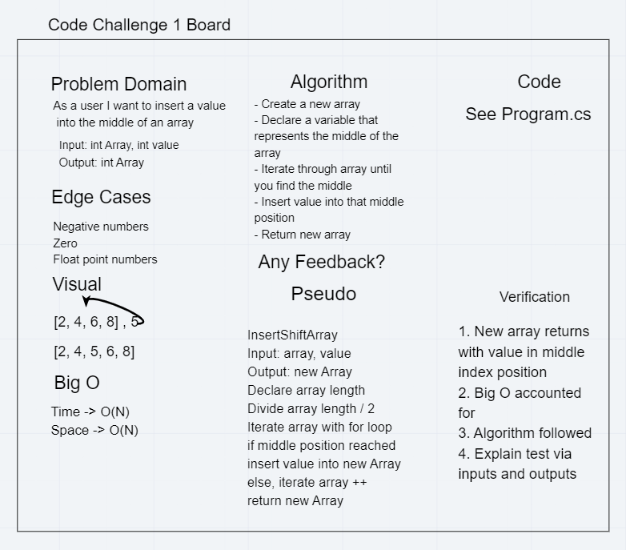

# Daily Code Challenge

## Array Shift
*Author: Na'ama Bar-Ilan*

---

### Problem Domain

Write a function called insertShiftArray which takes in an array and the value to be added. Without utilizing any of the built-in methods available to your language, return an array with the new value added at the middle index.

---

### Inputs and Expected Outputs

| Input | Expected Output |
| :----------- | :----------- |
| [2,4,6,8],5 | [2,4,5,6,8] |
| [4,8,15,23,42],16 | [4,8,15,16,23,42] |

---

### Big O

| Time | Space |
| :----------- | :----------- |
| O(n) | O(n) |

---

### Whiteboard Visual

---

### Change Log
1.2: *Completed feature task, added passing unit tests.* - 12 Jul 2020 
1.1: *Credit - collaborated with Robert Carter and used [Amanda Iverson's solution](https://github.com/Aiverson1011/Data-Structures-and-Algorithms/blob/master/Challenges/arrayShift/arrayShift/Program.cs) to help us understand the problem.* - 12 Jul 2020 

---

